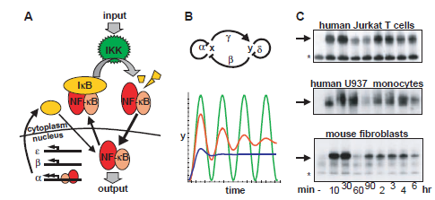
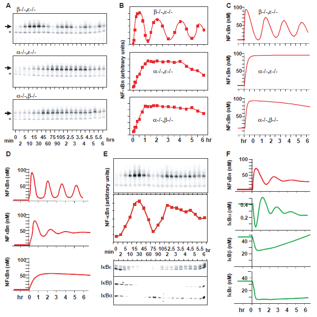
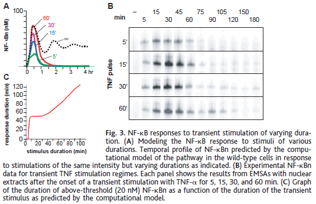
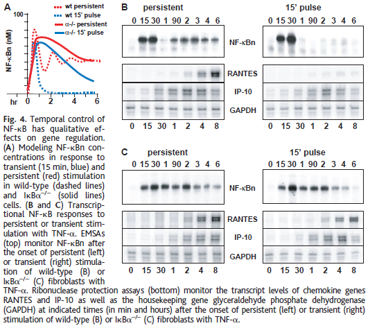

# The IkB–NFkB Signaling Module: Temporal Control and Selective Gene Activation

 = $\kappa$
 = $\alpha$
 = $\beta$
 = $\gamma$
 = $\delta$

전사 인자 NF-κB는 세포 내외 신호, 세포 스트레스 반응, 세포 성장, 생존 및 세포 자살에 중요한 역할을 하는 다수의 유전자를 조절한다. 이에 따라 유전자 발현의 특이성과 시간적 제어는 중요한 생리학적 관심사이다. 또한 만성 염증성 질환이나 화학 요법에서 NF-κB의 약제 표적 가능성을 실현하기 위해서는 NF-κB 반응성 유전자 발현을 조절하는 특이성 메커니즘을 이해하는 것이 필요하다.

---

Fig.1. 음의 피드백과 IκB–NF-κB 신호 모듈. 
- (A) IκB–NF-κB 신호 모듈. 세포 자극으로 인해 세포 표면 단백질의 활성화가 발생하고 이는 IKK 복합체의 활성화로 이어지며, IκB 단백질의 인산화 및 분해를 유발한다. 해방된 NF-κB는 핵로 이동하여 IκB\(\alpha\)를 비롯한 유전자를 활성화한다. IκB$\beta$와 -ε는 일정한 속도로 합성되어 NF-κB 활성화의 복잡한 시간적 제어를 가능하게 한다. 이는 음의 피드백을 포함하는다. 
- (B) 음의 피드백을 가진 두 요소 시스템(x와 y)은 상대적으로 효율적인 피드백 규제($\beta$와 $\gamma$)에 의해 진동의 지속성 대 자체 규제($\alpha$와 $\delta$)에 의해 진동의 감쇠가 결정된다. 이 관계는 수학적으로 dx/dt = S – $\alpha$x – $\beta$y 및 dy/dt = $\gamma$x – $\delta$y로 설명될 수 있으며, 여기서 S는 자극을 나타낸다. 출력인 y는 지속적인 진동(녹색 선, 높은 피드백 효율성 및 감쇠 없음, $\alpha$ = $\delta$ = 0)에서 감쇠 진동(빨간 선, 중간 피드백 효율성 및 중간 감쇠)까지 서서히 상승하여 평평한 수준에 도달한다(파란 선, 낮은 피드백 효율성 및 높은 감쇠). 빨간 선에 해당하는 시뮬레이션에서 $\alpha$와 $\delta$는 파란 선 생성을 위해 사용된 값의 30%이다. 
- (C) NF-κBn의 EMSA(TNF $\alpha$ 자극된 인간 T 세포, 인간 단핵구 및 쥐 섬유아세포에서). TNF$\alpha$ (10 ng/ml)로 지속적으로 자극을 시작한 후 지정된 시간에 핵 추출물이 준비되었다. 동등한 양의 핵 단백질이 핵 내 $\kappa$B site 서열을 포함하는 방사성 표지된 이중 가닥 올리고뉴클레오티드와 반응하였다. 화살표는 특정한 핵 NF-κB 결합 활동을 나타내고 별표는 비특이적인 DNA 결합 복합체를 나타낸다.

---

다섯 가지 관련된 포유류 유전자 제품이 NF-$\kappa$B 기능에 참여한다 (RelA/p65, cRel, RelB, p50, p52), 그러나 많은 세포 유형에서 우세한 종은 p65:p50 이다. 그의 활동은 주로 세 가지 I$\kappa$B 아이소폼 (I$\kappa$B$\alpha$, -$\beta$ 및 -ε)에 의해 제어된다. 이 아이소폼들은 NF-$\kappa$B에 결합하여 그것의 DNA와의 연관을 방지하고 그것을 세포질로의 위치로 유도한다. 다양한 자극으로부터의 신호는 I$\kappa$B 키나아제 (IKK) 복합체에 전달되며, 이 복합체는 각 I$\kappa$B 아이소폼을 인산화하고, 이에 따라 유비퀴틴화와 단백질 분해를 유도한다 (6). I$\kappa$B의 분해는 NF-$\kappa$B가 핵로 이동하여 DNA에 결합할 수 있도록 한다 (그림 1A). 각 I$\kappa$B 단백질의 특정 역할은 이해되지 않았다. 한 I$\kappa$B 유전자가 공학적으로 삭제된 쥐들은 남은 I$\kappa$B 가족 구성원들에 의한 주목할만한 분자적 보상 (7, 3)과 경미한 표현형 (8, 9)을 보인다. 그러나 I$\kappa$B$\alpha$$^{–/–}$ 쥐는 생후 기간 사멸로, 멀티-장기 염증, 아마도 많은 NF-$\kappa$B 반응성 유전자의 상승에 의해 (10, 11) 일으켜진다고 추정된다. 이 표현형은 주로 I$\kappa$B$\alpha$의 전사 조절을 통한 I$\kappa$B$\beta$ 코딩 영역의 위치로 구조적으로 회복된다 (12). I$\kappa$B$\alpha$ 합성은 NF-$\kappa$B에 높은 반응성을 보이는 프로모터에 의해 제어되며, NF-$\kappa$B 신호의 자가조절을 생성한다 (13).

IKK, I$\kappa$B 아이소폼 및 NF-$\kappa$B의 상호 작용은 음의 피드백을 포함하는 신호 전달 모듈로 생각할 수 있다 (그림 1A). 이 모듈은 세포 표면 수용체에서 기인하는 경로로부터의 신호를 받아들이고 (입력), 유전자 발현을 규제하는 핵 프로모터 결합 단백질 복합체에 신호를 전달한다 (출력). 음의 피드백을 가진 최소한의 시스템에서 (그림 1B), 두 신호 전달 구성 요소 간의 상호 규제는 음의 피드백의 강도 (상수 $\beta$ 및 $\gamma$)를 결정하고, 따라서 진동의 성향을 결정하며, 자가 조절 (상수 $\alpha$ 및 $\delta$)은 진동의 정도를 결정한다. 이러한 상수의 값에 따라, 지속적인 자극에 대한 응답은 지속적인 진동부터 누적 진동까지 다양할 수 있다 (그림 1B). 우리는 NF-$\kappa$B–반응성 유전자 발현에 대한 공간적인 부분적인 응답을 만들기 위해 세 가지 I$\kappa$B–NF-$\kappa$B 신호 전달 모듈을 생성했다. 그러나 예측된 최소한의 이중 구성 요소 시스템과는 달리, 응답은 강하게 감쇠된 진동을 닮았지만 구별되는 특성을 가졌다 (그림 1C). 우리는 모든 세 I$\kappa$B 아이소폼의 조화된 분해, 합성 및 위치 지정이 특징적인 NF-$\kappa$B 활성화 프로파일을 생성하는 데 필요하다고 결론지었다.

이들의 차별적인 기능을 다루기 위해 우리는 상통 미분 방정식을 기반으로 한 계산 모델을 구축했다. 모델 동작은 각 I$\kappa$B 아이소폼의 합성 (전사, mRNA 안정성 및 번역을 포함), 자유 및 NF-$\kappa$B-결합 I$\kappa$B 단백질의 안정성, 이상적인 이중 및 삼중 IKK–I$\kappa$B–NF-$\kappa$B 복합체의 형성, IKK 포함 복합체의 효소 활성 상수 및 각 구성 요소 (I$\kappa$B$\alpha$, -$\beta$ 및 -ε; NF-$\kappa$B; 및 파생된 복합체)의 위치 지정에 영향을주는 전송 속도를 설명하는 다양한 제어 매개 변수의 특정 값에 의존한다. 30 개의 독립적인 모델 매개 변수 중 많은 것들이 이전에 생화학적으로 결정되었으며, 나머지 값들은 출판된 데이터에 의해 제한될 수 있다 (14). 우리는 효과적인 모델 파라미터 맞춤을 위한 추가 제약 조건을 제공하기 위해 상반 유전학적 방법을 사용하여 줄인 세 가지 I$\kappa$B–NF-$\kappa$B 신호 전달 모듈을 만들었다.

---

Fig.2. 유전적으로 축소된 시스템을 기반으로 한 컴퓨터 모델. 
- (A) 표시된 유형의 섬유아세포를 TNF$\alpha$ (10 ng/ml)로 자극한 후 지정된 시간에 핵 추출물로부터 분리한 NF-$\kappa$Bn의 EMSA에 의한 분석. 화살표는 특정한 핵 NF-$\kappa$B 결합 활동을 나타내고 별표는 비특이적인 DNA 결합 복합체를 나타낸다. 
- (B) 지정된 유전형의 세포에서 NF-$\kappa$B에 특이적인 이동 변동이 인산화이미저에 의해 정량화되고 정규화되어 선형 시간 척도에 대해 그래프화된다. 
- (C) 각 유전적으로 단순화된 신호 모듈의 컴퓨터 모델링은 NF-$\kappa$Bn 반응의 특성적인 동력학을 결과로 낸다. 모델 맞춤을 통해 이전에 결정되지 않았던 생화학적 매개 변수를 추정할 수 있다. 
- (D) 단순화된 신호 모듈의 모델은 I$\kappa$B$\alpha$의 전사 속도를 일정하게 유지하면서 I$\kappa$B$\beta$ 및 -ε의 전사 속도를 증가시킨다. I$\kappa$B$\beta$ 및 I$\kappa$Bε의 유전자 전사속도를 다섯 배 (상단에서 중간으로) 증가시키고 다음에 일곱 배 (중간에서 하단으로) 증가시키면서 발생하는 모델 행동을 나타낸다. 하단 패널은 Fig. 2C에 표시된 단일 I$\kappa$B 이소폼 모델에서 사용된 것과 동일한 mRNA 합성 매개 변수를 가진 모델에 의해 예측된 NF-$\kappa$Bn 출력을 나타낸다. 
- (E) 암생화학적 분석 결과. 지속적인 TNF-$\alpha$ 자극 후 지정된 시간에 핵 추출물로부터 분리한 NF-$\kappa$Bn (상단)은 EMSA에 의해 분석되었다. 특정 NF-$\kappa$B에 대한 이동 변동은 인산화이미저에 의해 정량화되어 표시된 비선형 시간 척도에 대해 정규화되어 그래프화되었다. 해당 세포질 분획의 웨스턴 블롯은 특정 I$\kappa$B$\alpha$와 -$\beta$ (하단) 및 I$\kappa$Bε (위)에 대한 항체로 처리되었다. 
- (F) 암생화학적 모델을 검증. I$\kappa$B$\alpha$ 및 -$\beta$ mRNA 합성 매개 변수는 지속적인 NF-$\kappa$Bn 자극에 대한 반응에서 그래프화된 출력을 얻기 위해 질적 모델 맞춤을 통해 결정되었다. (상단) 및 I$\kappa$B$\alpha$, -$\beta$, -ε의 총 세포 농도 (아래 패널에서 지정된대로).

---

우리는 배아 줄기 세포의 표준 동종 조합 기술을 사용하여 I$\kappa$B$\beta$ 및 -ε를 삭제한 마우스를 개발했다 (14). 이들 마우스 및 기존 I$\kappa$B$\alpha$ 유전자가 삭제된 마우스 (10)는 올바르게 교배되어 단일 I$\kappa$B 아이소폼에 의해 NF-$\kappa$B의 핵 내 위치가 제어되는 배아 섬유아세포를 생성했다 (14). I$\kappa$B$\alpha$ 아이소폼만 포함하는 섬유아세포에서의 TNF$\alpha$ 자극은 6시간 실험 과정에서 네 개의 균일한 간격의 피크를 가진 고주파 NF-$\kappa$B 응답을 초래했다 (그림 2A 상단). 반면에, 오직 I$\kappa$B$\beta$ (그림 2A 중간) 또는 -ε (그림 2A 하단)를 가진 세포에서는 NF-$\kappa$Bn이 1시간 후에 평평한 고원으로 단조롭게 증가했으며, 이후 유의한 억제가 없었다.

$\beta$$^{–/–}$ε$^{–/–}$, $\alpha$$^{–/–}$$\beta$$^{–/–}$ 및 $\alpha$$^{–/–}$ε$^{–/–}$ 세포의 단순화된 계산 모델은 각각 출력을 제어하는 17개의 부분적으로 겹치는 매개 변수를 포함하고 있으며, 이 중 9개는 이전에 생화학적으로 결정되었다. 또한, 5개의 운송 매개 변수는 안정 상태의 핵 및 세포질 위치로부터 유도된 비율에 의해 제한된다 (17, 18). 그들의 절대 값과 I$\kappa$B 합성 매개 변수는 모델 출력을 실험 데이터에 반영하기 위해 반정량적으로 적합되었다. 유전적으로 감소된 신호 전달 모듈의 세 가지 모델을 결합하면 와일드 타입 세포의 I$\kappa$B–NF-$\kappa$B 신호 전달 모듈의 계산 모델이 생성된다. 그들의 상대적인 기여를 변화시키면 포유류 I$\kappa$B 단백질의 NF-$\kappa$B 규제에서 이산 기능적 역할이 드러난다 (그림 2D). I$\kappa$B$\alpha$는 빠른 NF-$\kappa$B 활성화와 강력한 음의 피드백 규제를 매개하며, 진동성 NF-$\kappa$B 활성화 프로필을 초래한다. I$\kappa$B$\beta$ 및 -ε는 IKK 활성화에 더 느리게 반응하고 NF-$\kappa$B 응답의 장기간 진동을 완화하는 역할을 한다. 이러한 아이소폼 간의 상호 작용은 자극 시작 또는 중단에 대한 매우 빠른 반응을 초래할 수 있으며, 장기간 자극 중에 상대적으로 안정적인 NF-$\kappa$B 응답을 허용할 수 있다 (그림 2D, 중간). 강력한 음의 피드백 효율이 부족한 경우, 출력의 장기간 진동이 나타날 수 있으며 (그림 2D, 상단), 이는 예를 들어 p53-mdm2 교차 규제 (19)에서 관찰되었다. 와일드 타입 NF-$\kappa$B 신호 전달에서는 명확한 진동이 없으며, 이는 I$\kappa$B$\beta$$^{–/–}$I$\kappa$Bε$^{–/–}$ 암컷의 생식 기간이 급격히 단축된다는 결과가 있었다 (3). 우리의 결과는 I$\kappa$B$\alpha$, -$\beta$ 및 -ε의 상대적인 합성 수준을 변화시키는 것이 NF-$\kappa$B 신호 전달 경로의 반응성을 변경하는 메커니즘일 수 있으며, 세포 또는 세포 계통이 환경 또는 발생적 신호에 대응하기 위해 사용할 수 있는 메커니즘임을 제안한다.

Wild-type 섬유아세포에서의 단일 I$\kappa$B 아이소폼 모델의 개별 기여를 결정하기 위해 우리는 TNF$\alpha$ 자극 기간 동안 NF-$\kappa$Bn (그림 2E 상단) 및 I$\kappa$B 단백질에 대한 Western blot (그림 2E 하단 패널)을 통해 핵 및 세포질 추출물을 분석했다. NF-$\kappa$Bn은 I$\kappa$B$\alpha$ 수준이 신속하게 감소하는 5분 내에 처음 나타났으며, 최대 농도에 이르렀으며, 이 때 세포질 I$\kappa$B$\beta$ 및 -ε가 사라졌다. 60분 후에는 $\kappa$B 결합 활성이 동시에 감소했고, I$\kappa$B$\alpha$ 단백질 수준이 일시적으로 증가했다. 2시간 후에는 NF-$\kappa$Bn이 최대 수준으로 다시 돌아가고, 이때 I$\kappa$B$\alpha$ 수준이 안정되고 I$\kappa$B$\beta$ 및 -ε 단백질이 재출현했다. 모델 맞춤을 통해 최적화된 재구성 모델과 실험적인 와일드 타입 응답이 가능했도록 I$\kappa$B$\beta$ 및 -ε mRNA 합성 매개 변수를 결정했다 (그림 2F). 이러한 매개 변수는 해당 단일 I$\kappa$B 모델에 대해 결정된 것보다 약 7배 낮았으며, I$\kappa$B 유전자의 발현에서 이전에 인식되지 않았던 상호 규제를 시사한다. 결과적인 "와일드 타입" 모델의 출력은 실험 데이터와 양적 및 질적으로 좋은 일치를 보이며, 이로써 실험에서의 예측 도구로서의 사용을 정당화한다.

---

Fig.3. 다양한 기간의 일과성 자극에 대한 NF-$\kappa$B 반응. 
- (A) 다양한 기간의 자극에 대한 NF-$\kappa$B 반응을 모델링함. 시간에 따른 NF-$\kappa$Bn의 예측된 시간 프로필은 동일한 강도의 자극에 대한 wild-type 세포의 경로의 컴퓨터 모델에 의해 표시된다. 
- (B) 일과성 TNF 자극 체계에 대한 실험적 NF-$\kappa$Bn 데이터. 각 패널은 TNF-$\alpha$에 대한 일시적 자극 시작 후 5, 15, 30 및 60 분에 대한 EMSA 결과를 보여준다. 
- (C) 컴퓨터 모델에 의해 예측된 일시적 자극의 기간에 따른 임계값 이상 (20 nM)의 NF-$\kappa$Bn 지속 시간의 그래프.

---

그 후 우리는 일시적 자극이 NF-$\kappa$B 활성을 어떻게 제어하는지 조사했다. 모의적인 짧은 자극은 첫 번째 시간 이내에 자극의 기간에 무관한 일시적 NF-$\kappa$B 활성 반응을 초래했다 (그림 3A). 일시적으로 자극된 세포에서 NF-$\kappa$Bn을 측정하여 이 예측을 확인했다: 5, 15, 30 및 60분 동안의 TNF$\alpha$ 펄스는 유지적으로 자극된 NF-$\kappa$B 활동의 첫 번째 피크에 해당하는 유사한 기간의 DNA 결합 활동 프로파일을 보여주었다 (그림 3B). I$\kappa$B–NF-$\kappa$B 신호 전달 모듈의 신호 처리 특성을 탐구하기 위해 임의의 $\kappa$B-반응성 프로모터에 대한 NF-$\kappa$Bn의 이용 가능 시간을 고려했다. 임계 농도 이상의 NF-$\kappa$Bn의 지속 시간을 TNF$\alpha$ 자극의 기간의 함수로 표시했다 (그림 3C). 장기간 자극의 경우 NF-$\kappa$Bn은 자극의 기간만큼 지속된다. 1시간 미만의 자극의 경우 응답의 지속 시간이 크게 변하지 않는다. 따라서 I$\kappa$B–NF-$\kappa$B 신호 전달 모듈은 이중 모드의 신호 처리 특성을 가지며, 하나의 신호 처리 모드는 짧은 자극이 상당한 NF-$\kappa$B 응답을 유발하도록 보장하며, 다른 모드는 1시간 이상의 자극에서 작동하여 응답이 자극의 기간에 비례하는 응답을 생성한다.

---

Fig.4. NF-$\kappa$B의 시간적 조절이 유전자 규제에 미치는 질적 영향.

- (A) 일과성 (15분, 파랑) 및 지속성 (빨강) 자극에 대한 NF-$\kappa$Bn 농도를 모델링한 것으로, wild-type (점선) 및 I$\kappa$B$\alpha$$^{–/–}$ (실선) 세포에서의 결과를 보여준다. 
- (B 및 C) TNF-$\alpha$에 대한 지속성 또는 일시적 자극에 대한 전사적 NF-$\kappa$B 반응. 위쪽은 NF-$\kappa$Bn이 TNF-$\alpha$로 wild-type (B) 또는 I$\kappa$B$\alpha$$^{–/–}$ (C) 섬유아세포를 지속적(왼쪽) 또는 일시적(오른쪽)으로 자극한 후의 EMSA 결과를 보여준다. 아래쪽은 지속적(왼쪽) 또는 일시적(오른쪽)으로 TNF-$\alpha$로 wild-type (B) 또는 I$\kappa$B$\alpha$$^{–/–}$ 
- (C) 섬유아세포를 자극한 후 트랜스크립트 수준을 보여주는 리보누클레아제 보호 분석 결과이다. 여기에는 화학유도 유전자 RANTES와 IP-10 및 대사 활성화 유전자인 glyceraldehyde phosphate dehydrogenase (GAPDH)의 전사 수준이 표시되어 있다.

---

위에서 설명한 시간적 규제 스위치의 한 가지 함의는 일부 NF-$\kappa$B–반응성 유전자가 15분만의 짧은 자극 펄스로도 효과적으로 활성화될 수 있다는 것이다 (그림 4A, 파란 점선). 그러나, NF-$\kappa$B에 노출된 시간이 긴 (> 1시간) 다른 유전자가 있을 수 있다. 이 가설을 검증하기 위해 서로 다른 전사 활성화 프로파일을 나타내는 두 가지 NF-$\kappa$B–조절 유전자의 행동을 조사했다. 하나는 화학물질인 IP-10을 인코딩하는 유전자로, TNF-$\alpha$ 자극 후 30분 이내에 감지 가능한 mRNA 수준을 나타냈다 (그림 4B) (14). TNF-$\alpha$의 15분 펄스는 IP-10 전사를 활성화하는 데 충분했으나, 예상했듯이 지속적인 자극은 후속 시간에서 IP-10 mRNA의 더 큰 양을 생성했다. 대조적으로, 화학물질 유전자 RANTES는 감지 가능한 발현을 위해 최소 2시간 동안의 자극이 필요했으며, 더 짧은 일시적인 자극으로는 유발되지 않았다 (그림 4B). 모델은 I$\kappa$B$\alpha$가 없는 세포에서 짧은 TNF-$\alpha$ 펄스 후에 NF-$\kappa$B가 더 긴 핵 내 수명을 가질 것으로 예측한다 (그림 4A, 빨간 실선). 실제로 일시적인 자극은 긴 자극에서 나오는 응답과 유사하게 $\kappa$B 결합 활성의 연장된 피크로 이어졌다 (그림 4, B 및 C의 상단 패널 비교). 반면에, RANTES 유전자 전사는 지속적인 자극 뿐만 아니라 I$\kappa$B$\alpha$–/– 세포에서 15분의 짧은 자극으로도 유발되었다 (그림 4C).

따라서, I$\kappa$B–NF-$\kappa$B 모듈의 이중 시간적 신호 처리 특성은 유전자 발현의 양적 뿐만 아니라 질적 규제를 통해 두 가지 유형의 유전자를 정의한다는 결과를 초래한다: 지속적인 NF-$\kappa$B 활성화가 필요한 유전자와 그렇지 않은 유전자. 후자의 유전자(IP-10 등)는 일시적인 TNF-$\alpha$ 자극의 정확한 기간과 상관없이 표준 활성화 프로그램을 거친다. I$\kappa$B–NF-$\kappa$B 신호 처리는 매우 짧은 자극조차도 이러한 유전자의 전사 활성화를 쉽게 감지할 수 있도록 보장한다. 반면에, 전자의 유전자(RANTES 등)는 NF-$\kappa$B로 유도되는 전사 인자의 발현이 필요한 경우도 있고 그렇지 않은 경우도 있다. RANTES 유도는 단백질 합성에 독립적이며 (3), RANTES 유도의 지연 원인에 대한 메커니즘은 알려져 있지 않지만, RANTES 프로모터의 히스톤 H4 아세틸화가 매크로페이지에서 리폴리사카라이드에 의해 유도되는 반면, 다른 많은 화학물질 프로모터에서는 구성적이다 (20). H4 아세틸화는 염색질 접근성을 나타내는 표지이며, NF-$\kappa$B 결합이 내적 프로모터에 선행될 때, 이것은 NF-$\kappa$B에 의존하지 않는 경로에 의해 유도될 수 있다. 우리의 결과는 두 개의 신호 전달 경로를 시간적으로 구별하여 유전자 발현의 특이성을 달성할 수 있다는 것을 시사한다. 두 경로가 시간적으로 조화를 이룰 때에만 유전자 유발이 발생한다.
우리의 분석은 세포 행동을 시스템 역학의 통제를 통해 조절하는 생물학적 시스템인 I$\kappa$B–NF-$\kappa$B 신호 전달 모듈을 밝혀냈다. 줄인 유전적 시스템의 생성은 복잡한 동적 행동을 계산적으로 분석하는 것을 가능하게 했다. 계산 모델의 탐구는 상호 관련이 없어 보이는 시스템 구성 요소의 생리학적으로 관련성이 있는 차이있는 기능에 대한 통찰력을 제공했다. 그들의 독특하지만 조화된 합성 및 분해 규제는 신호 처리 특성을 보여주며, 이는 신속한 신호 응답과 안정적인 장기 응답을 나타낸다.
